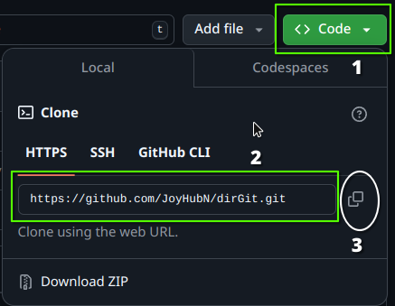
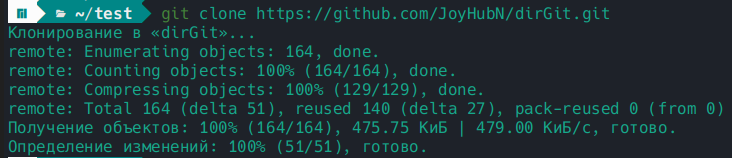
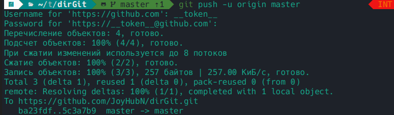
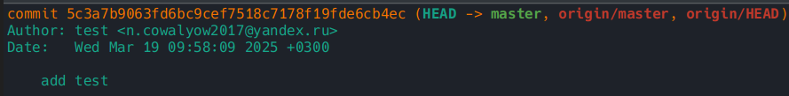

# Клонирование репозитория
```bash
git clone https://github.com/nameUser/nameRep.git
```
<br>
<ul>
    <li>nameUser — имя пользователя</li>
    <li>nameRep — название репозитория</li>
</ul>



# Отправка изменений
```bash
touch test && git add . && git commit -m 'add test'
```
<p>Затем нужно авторизоваться и отправить изменения</p>


<br><br>
Выведем лог
<br><br>

```bash
git log
```
